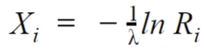
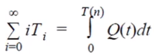
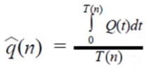

# Summary

This project uses vanilla Java 11 to implement a simulation.

## Simulation problem statement

At Metropolis City Hall, two workers “pull strings” (make deals) every day.
Strings arrive to be pulled on an average of one every 10 minutes throughout the day. It
takes an average of 15 minutes to pull a string. Both times between arrivals and service
times are exponentially distributed.

# Starting the project

Java must be preinstalled. Version (LTS version was used):

```shell
$ java --version
openjdk 11.0.11 2021-04-20
OpenJDK Runtime Environment (build 11.0.11+9-Ubuntu-0ubuntu2.20.04)
OpenJDK 64-Bit Server VM (build 11.0.11+9-Ubuntu-0ubuntu2.20.04, mixed mode, sharing)
```

The project is ready for use in JetBrains IDEA Community or JetBrains IDEA Ultimate (version 2021.2.3 was used).

To compile the program from project root CLI:
```shell
javac -d ./out/production/simple-sim/ ./src/se/lnu/_4dv650/bs222sa/simulation/**/*.java ./src/se/lnu/_4dv650/bs222sa/simulation/*.java
```

After compiling, the program can be run as (**the output is stdout**):
```shell
java -Dfile.encoding=UTF-8 -classpath ./out/production/simple-sim se.lnu._4dv650.bs222sa.simulation.Main
```

Or **the file can be used for output** (file name is the last CLI argument): 
```shell
java -Dfile.encoding=UTF-8 -classpath ./out/production/simple-sim se.lnu._4dv650.bs222sa.simulation.Main ./out/output.txt
```

# Project description

The parent package is `se.lnu._4dv650.bs222sa.simulation`.

## Simulation properties

The model given is M/M/2 queue (λ = 1/10, μ = 1/15, ρ = .75).

Since both inter-arrival and service time distributions are exponential or Markov, the formula for calculating the pseudorandom value is



where R<sub>i</sub> - a uniformly distributed random value in range `[0; 1)`, `-1/λ` - is mean of Markov distribution (the value for inter-arrival time is 10 since the interval is 10 minutes, for service time - 15).

The value R<sub>i</sub> for the implementation is produced by a Java implementation of pseudo-random number generator `java.util.Random.nextDouble()`.

There 2 alternative stopping conditions:
- time-based - when the required time comes;
- event-based - when the required amount of events is departed.
  The condition can be changed by commenting strictly one line from lines 72 - 73 of `se.lnu._4dv650.bs222sa.simulation.Main`.

### How do you advance the time?
The simulation runs uses **fixed-increment time advance**. However, the inter-arrival and service times are the multiple of the fixed-increment, so the actual changes happen only when next most imminent event comes. The fixed-increment time-advance approach was chosen because of easier and more flexible design.

The clock itself is initialized at 0.

### How do you represent the system state?

- **Clock** contains start time, fixed-increment (tick) size, current time.
- Each **server** has the current event that the server is processing. So, the state of the server is binary. If this event is absent, then the server is _IDLE_, if the event is present, the server is _BUSY_. Additionally, the server can contain the timestamp of the event processing finish only if the server is _BUSY_.
- **Queue** contains the list of events, that have to be processed, and the count of all produced events as well as currently enqueued events. Additionally, the queue contains the timestamp of the next event production.
- **Event** contains the state property (_Queued_, _Serving_, _Departed_) and timestamps of enqueuing, start and finish of processing.
- **Statistics collector** contains the average size of the queue that is updated during each iteration.

### What are the events you should process?

Conceptually, there are 4 types of events:
- initialization event;
- arrival event;
- processing start event;
- processing finish (departure) event;
The implementation uses one class for the last three events and differentiates the event type by the class state (_Queued_, _Serving_, _Departed_).

### How do you compute the statistics?

The raw data for the statistics is being accumulated during entire simulation and is finally calculated after the simulation is done. The statistics includes:
- Average inter-arrival time is calculated as average among the differences between arrival times of each 2 consequent events.
- Average event waiting time in queue is calculated as average of all waiting times.
- Average event service time in queue is calculated as average of all service times.
- Average queue size is calculated according to formulae:

  where i is the number of events in queue and T<sub>i</sub> - the amount of time, T(n) - total time.

  The implementation accumulates (recalculates) this value on each fixed-time iteration.
- Average server utilization is calculated by the counter in each server, which is increased at each fixed-time iteration (tick) only if the server is busy. These counters are later divided by the total time.
- Total time required is retrieved from the clock.
- Total events produced is retrieved from the queue.
- Total processed (departed) events are summed up.
- Current events in progress (being processed by servers) is retrieved from the current servers' event.
- Current events in queue (waiting for processing by servers) is retrieved from the queue size.

## Project structure

There is a `components.*` subpackage, which contains all the types for simulation and a `se.lnu._4dv650.bs222sa.simulation.Main` class, which is an entry point class.

### Main class

The class contains constants and static fields for all the components.

The `main()` method:
1. Initializes simulation:
   1. Create `EventQueue` - storage for events to be processed;
   2. Create `Clock` - a clock with ability to do increase the time on-demand (tick the clock);
   3. Create `SimulationRandom` - a helper with random-number methods for simulation.
   4. Create `QueueProducer` - a class which produces the event to the aforementioned `EventQueue` and counts the produced events;
   5. Create `DepartedCollector` - a class for storing departed (already processed events) for further statistics calculation.
   6. Create several `StringPullServer` - a list of servers that will consume events from `EventQueue`, "process" it, and add it to `DepartedCollector`;
   7. Create `StatisticsCollector` - a class for calculating statistics (average queue size) after each clock tick;
   8. Create `ClockRunner` - a class that runs the actual simulation. It calls updates on each `Clock` tick.
2. Runs simulation - uses while loop to run the simulation until time limit or event limit is reached;
3. Collects and groups events from simulation for metrics calculation;
4. Prints statistics and metrics;

### Subpackage `.components` and ideas behind the design

For implementation 3 main ideas were used:
- _a major inspiration source_ - frame-by-frame rendering systems, which update the screen every "tick" or every `n` milliseconds (e.g. game engines, such as Unity and its game components). The identical approach was used for the main simulation loop, which calls the `ClockRunner.tick()`;
- a classical producer-consumer parallel programming problem. In this implementation only the main concept was used, not the original thread-based Java solution of this problem. `QueueProducer` is producer, `StringPullServer` is consumer.
- SOLID principles in code design.

Using a tick-based simulation together with SOLID principles allow creating a flexible code architecture, that is straightforward, easy-to-read, extensible and maintainable.

Calling `ClockRunner.tick()` updates the `Clock` and calls all `ClockRunnable` implementors which are `QueueProducer`, `StringPullServer` and `StatisticsCollector`. Interface `ClockRunnable` has a single method - `void updateOnTick(CurrentTime time);`, that is called after each `Clock` update.

`SimulationEvent` keeps track of state of event and event-related statistics, which includes `state` (an enum), `arrivalTime`, `serviceStartTime`, and `serviceFinishTime`. The simple state machine by `state` field and other 3 aforementioned fields allow quickly calculate different event metrics, such as service time and delay in queue.
